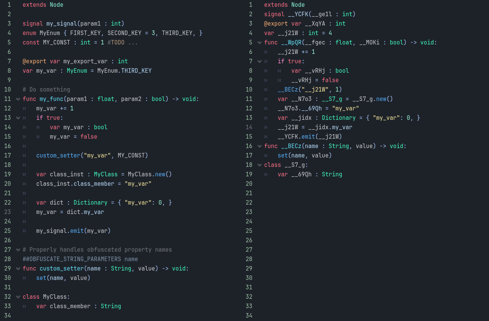
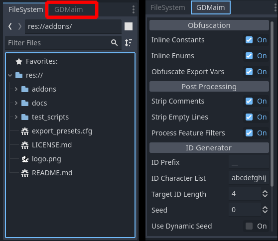
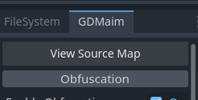
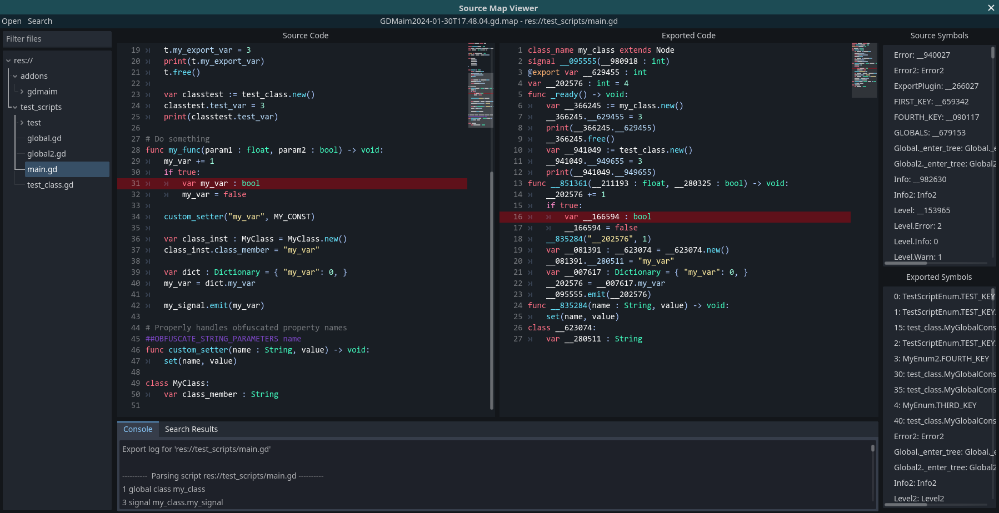
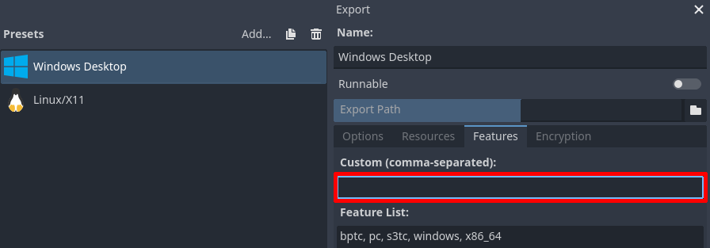
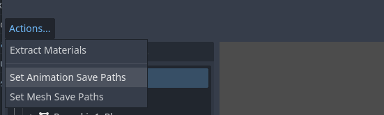

# GDMaim

A plugin for the [Godot Engine] which obfuscates all GDScripts when exporting a project, resulting in increased difficulty of successful reverse engineering.


[](https://godotengine.org/)
[](LICENSE.md)

## Table of contents

- [Why does this exist?](#why-does-this-exist)
	- [Vulnerability of GDScripts](#vulnerability-of-gdscripts)
	- [Obfuscation](#obfuscation)
	- [Example](#example)
- [Installation](#installation-)
- [Configuration](#configuration-)
- [Usage](#usage-)
	- [Source map viewer](#source-map-viewer)
	- [Export template feature tags](#export-template-feature-tags)
	- [Preprocessor hints](#preprocessor-hints)
- [Limitations and caveats](#limitations-and-caveats-)
- [Stability](#stability-)
- [External Libraries](#external-libraries-)
- [Issues](#issues-)
- [Troubleshooting](#troubleshooting-)
- [Roadmap](#roadmap-)
- [License](#license-)

## Why does this exist?

### Vulnerability of GDScripts

GDScripts are stored as is when exporting a project, which makes it very easy for anyone to gain full access to the original source code, using tools like [gdsdecomp](https://github.com/bruvzg/gdsdecomp). Godot does have built-in [encryption](https://docs.godotengine.org/en/stable/contributing/development/compiling/compiling_with_script_encryption_key.html), but that will only deter people who don't know about [gdke](https://github.com/pozm/gdke), which extracts the encryption key from the executable.

Thus, it's very easy for people to get the entire GDScript source code of any exported project.
This also means that writing cheats for multiplayer games becomes a lot easier, which includes finding and taking advantage of vulnerabilities in server-authoritative code.

### Obfuscation

This plugin tries to make reverse engineering harder by [obfuscating](https://en.wikipedia.org/wiki/Obfuscation_(software)) the source code of all exported scripts.
Since only the exported 'pck' file gets processed, obfuscation is non-destructive to the project itself. It among other things, generates random names for identifiers, hardcodes enum and constant values and strips out comments and empty lines.

It does of course not make reverse engineering impossible, but will act as a way greater barrier than just encryption for example, which can be easily bypassed by just downloading a publicly available tool.

### Example

Source code(left), obfuscated code(right)



## Installation [↑](#table-of-contents)

> Note: Requires Godot 4.0+. Developed and tested on Godot 4.2-stable.

1. Download a [release build](https://github.com/cherriesandmochi/gdmaim/releases) or the latest [main branch](https://github.com/cherriesandmochi/gdmaim/archive/refs/heads/main.zip).
2. Extract the zip file and copy `addons/gdmaim` to the project's `res://addons` directory.
3. Go to `Project` -> `Project Settings` -> `Plugins` and enable GDMaim

## Configuration [↑](#table-of-contents)

To configure this plugin, open the GDMaim dock on the bottom left, right next to the file dock.



### Obfuscation

`Enable Obfuscation`: If enabled, obfuscate scripts. Does _not_ affect post-processing.

`Obfuscate Exports Vars`: If enabled, obfuscate export vars.
> Note: Requires all resources which modify export vars to be saved as '.tres' files.

`Shuffle Top-Level Declarations`: Shuffles the line positions of top-level declarations, such as variables, functions and classes.

`Inline Statements`: If enabled, aggressively compresses multiple lines of code into as little lines as possible.

`Inline Constants`: If enabled, accesses to constants will be replaced with hardcoded values. Declarations of constants get removed.

`Inline enums`: If enabled, accesses to enum keys will be replaced with hardcoded values. Declarations of enums get removed.

`Preprocessor prefix`: The prefix to use for preprocessor hints.

### Post Processing

`Strip Comments`: If enabled, remove all comments.

`Strip Empty Lines`: If enabled, any line without code will be removed.

`Strip Extraneous Spacing`: If enabled, spaces and tabs that are not required, get removed.

`Strip Editor Annotations`: If enabled, annotations used exclusively by the editor will be removed.

`Strip Lines Matching RegEx`: If enabled, any lines matching the regular expression will be removed.

`Process Feature Filters`: If enabled, process automatic filtering of code, based on export template feature tags. For more information, see [feature filters](#preprocessor-hints).

`Export Mode`: Defines the final format in which the scripts will be exported. This has the same function as the script export option from the editor, allowing to choose between plain text, binary tokens or compressed binary tokens.

### Name Generator

`Prefix`: Sets the prefix to use for all generated names.

`Character List`: A list of characters the name generator is allowed to use.

`Target Name Length`: The length of names the generator will try to target. The length does _not_ include the prefix.

`Seed`: The seed the name generator will use to generate names. A given seed will always produce the same name for every identifier.

> Note: The set value will be ignored, if `Use Dynamic Seed` is enabled.

`Use Dynamic Seed`: If enabled, automatically generate a random seed every time the project is exported.

> Warning: Dynamic seeds will produce unique scripts on each export, which might potentially 'break' delta updates, as used by Steam for example. It also makes debugging harder.

### Source Mapping

`Output Path`: The path where source maps will automatically be saved to upon export.

`Max Files`: The maximum amount of saved source maps. When the limit has been reached, replace the oldest one.

`Compress`: If true, compress the source maps before export to take up less space.

`Inject Name`: If true, searches for the first enabled autoload during export and inserts a print statement into its `_enter_tree` method(or creates a new one if it does not exist). The print statement contains the filename of the associated source map that got generated during the export of that build.

## Usage [↑](#table-of-contents)

> Please read [limitations and caveats](#limitations-and-caveats-) to make sure your project can export properly.

While enabled, GDMaim automatically obfuscates scripts and resources during export.
As mentioned earlier, the obfuscation only affects the exported '.pck' file, but as always, make sure to use version control.

### Source map viewer

During export, a source map for the current build will be generated and saved. By default `Max Files` is set to only keep the 10 latest files, so every time you actually release a build, make sure to copy the associated source map somewhere safe.

__Debugging using source maps__



Open the source map viewer by navigating to the GDMaim dock and selecting `View Source Map`. Next, open the source map you want to view.

On the left side you will find a file tree, containing all exported scripts. Double-clicking on one will open it.

Once a script has been opened, both the source and exported code will be shown. By selecting a line in either code, you can get the equivalent line in the other code.



### Export template feature tags



Feature tags allow configuration on per export template basis.

Using `no_gdmaim` as feature tag, will completely disable obfuscation for that specific export template.

> Warning: Do not distribute builds made with `no_gdmain` export templates!

If [`Process Feature Filters`](#post-processing) is enabled, custom feature tags may be used to automatically filter code. See: [feature filters](#preprocessor-hints).

### Preprocessor hints

__Obfuscation__

`##LOCK_SYMBOLS`: Prevents obfuscation of identifiers _declared_ in the current line.

```js
var my_var : int ##LOCK_SYMBOLS
var my_var2 : int
my_var2 = 0 ##LOCK_SYMBOLS
```

=>

```js
var my_var : int ##LOCK_SYMBOLS
var __6vjJ : int
__6vjJ = 0 ##LOCK_SYMBOLS
```

> Note: Globally accessible names are shared with all scripts, which in the above example means that `my_var` declarations will _not_ get obfuscated in _any_ script.

`##OBFUSCATE_STRINGS`: Obfuscates all strings in the same line.

```js
var my_var : int
set("my_var", 1) ##OBFUSCATE_STRINGS
```

=>

```js
var __pQFC : int
set("__pQFC", 1) ##OBFUSCATE_STRINGS
```

`##OBFUSCATE_STRING_PARAMETERS arg_name`: Must be at the beginning of a line and before a function declaration. For all specified _string_ parameters, obfuscate the arguments when the function is called.

```js
##OBFUSCATE_STRING_PARAMETERS name
func custom_set(name : String, value) -> void:
	set(name, value)

var my_var : int
custom_set("my_var", 3)
```

=>

```js
##OBFUSCATE_STRING_PARAMETERS name
func __U5iZ(name : String, value) -> void:
  set(name, value)

var __rEyW : int
__U5iZ("__rEyW", 3)
```

__Feature filters__

Feature filters provide a way to dynamically strip out code based on the export template feature tags set. There is currently only one preprocessor hint.

`##FEATURE_FUNC feature_tag`: Must be at the beginning of a line and before a function declaration. Removes the entire implementation of the function if the specified feature tag has not been defined in the current export template.

```js
##FEATURE_FUNC server
func server_func() -> int:
	var x : int = 0
	for i in 10:
		x += 1
	return x
```

=> If the feature tag 'server' has not been defined in the current export template:

```js
##FEATURE_FUNC server
func __Dg8o() -> int:
  printerr("ERROR: illegal call to 'test.__Dg8o'!")
  return 0
```

## Limitations and caveats [↑](#table-of-contents)

This section offers solutions to various limitations of this plugin.

### Resource formats

The obfuscator does not yet support parsing and obfuscating binary files.
Thus, if `Obfuscate Exports Vars` is enabled, every custom resource or packed scene containing export vars must be saved as '.tres' and '.tscn', respectively. Packed scenes must also be saved as '.tscn', if they contain signal connections or embedded scripts. As of now, you should probably just avoid binary packed scene files altogether if you want to use this addon.

Since binary files are not supported the script exporting option must be kept to text in Godot 4.3, otherwise no scripts will be exported.

**Script Export Option**


It is still possible to export in the binary token formats via the GDMaim `Export Mode` option, which will override the plain text format after obfuscation has concluded.

### Static typing

In order for the obfuscator to work as well as possible, I recommend heavy use of [static typing](https://docs.godotengine.org/en/stable/tutorials/scripting/gdscript/static_typing.html). Although this mostly affects just dictionaries at the moment.

__Dictionaries__

The easiest way to access dictionaries without any issues is by using `get` or the `[]` operator.
By default, the obfuscator will treat the `.` operator as property access, and thus potentially obfuscate the specified key by mistake. This can be avoided by statically typing dictionaries, although with a limitation: the dictionary must be a property of the _same_ script, a static variable of a named script, a property of an autoload or a local variable(which includes function parameters).

```js
class_name Test extends RefCounted

const KEY : int
var prop_dict : Dictionary = { "KEY": 0, }

func my_func(param_dict : Dictionary = { "KEY": 0, }) -> void:
  var local_dict : Dictionary = { "KEY": 0, }
  var inferred_dict := { "KEY": 0, }
  local_dict.KEY = 1 # valid
  param_dict.KEY = 1 # valid
  prop_dict.KEY = 1 # valid
  Test.new().prop_dict.KEY = 1 # invalid!
  inferred_dict.KEY = 1 # invalid!
```

###  String identifiers

Some built-in functions use string names as identifiers, which will not work without workarounds.
Most of those functions, however, can be avoided completely.

__Signals__

Using the [`Signal`](https://docs.godotengine.org/en/stable/classes/class_signal.html) class directly requires no further workarounds.

```js
Object.connect() -> Signal.connect()
Object.disconnect() -> Signal.disconnect()
Object.emit_signal() -> Signal.emit()
```

__Calls and RPCs__

Use [`Callables`](https://docs.godotengine.org/en/stable/classes/class_callable.html) instead of calling methods via string names.

```js
Object.call() -> Callable.call()
Object.callv() -> Callable.callv()
Object.call_deferred() -> Callable.call_deferred()
Node.rpc() -> Callable.rpc()
Node.rpc_id() -> Callable.rpc_id()
```

__Set/get__

Because properties cannot be referenced directly, setting and getting requires a bit extra work.

Use either `##OBFUSCATE_STRINGS`:

```js
set("test_var", 0) ##OBFUSCATE_STRINGS
```

...or `##OBFUSCATE_STRING_PARAMETERS` with a wrapper method(recommended):

```js
##OBFUSCATE_STRING_PARAMETERS property
func set_wrapper(property : String, value) -> void:
  set(property, value)

set_wrapper("test_var", 0)
```

### Shared identifier names

Due to the dynamic nature of GDScript, the obfuscator cannot safely assume the script attached to an object. Consequently, all global identifiers, like property and function names for example, will share the same generated symbol name. Therefore, disabling the obfuscation of an identifier, will also do so for every identical identifier _anywhere_ in the project.

> The above limitation also applies to built-in classes, types, functions, etc. An identifier called `current_animation` for example, will _never_ get obfuscated, as `AnimationPlayer.current_animation` already exists.

### Animated meshes

When using imported animated meshes in 'tscn' files, animations seem to always get embedded, which may take up a huge amount of space and significantly stall the obfuscation.
To avoid that, save all animations to external files.
This can be done automatically by double-clicking the imported file('.glb' for example) and navigating to `Actions` -> `Set Animation Save Paths`.



> Note: `Set Animation Save Paths` currently ignores the `-loop`/`-cycle` import hints, so you have to manually set the loop mode for each looped animation.

## Stability [↑](#table-of-contents)

Developed using Godot 4.2-stable.

GDMaim manages to successfully export a multiplayer game I have been working on for quite some time now, which currently means ~450 scripts, containing ~43k lines of code.

I also successfully exported the following 4 projects, after doing some minor tweaks:

* [Official Third Person Shooter Demo](https://github.com/godotengine/tps-demo)
* [GDQuest's Third Person Shooter Demo](https://github.com/gdquest-demos/godot-4-3d-third-person-controller/)
* [Official 3D Platformer Demo](https://github.com/godotengine/godot-demo-projects/tree/master/3d/platformer)
* [Godot 4 FPS Prototype](https://github.com/Dodoveloper/godot4-fps-prototype)

## External Libraries [↑](#table-of-contents)
This plugin currently uses **gdbc** to convert scripts to bytecode, you can find the repository at [Github Repository](https://github.com/CodeNameTwister/gdbc)

## Issues [↑](#table-of-contents)

This does of course _not_ mean that there aren't any issues. I believe there are _tons_ of edge cases still left which break obfuscation, but I also do think, that with workarounds, every or most projects should be able to export.

If you have any issues or questions, please feel free to contact me!
You can of course try to fix issues yourself as well, but that would require you to decipher the abomination this plugin's code is.

## Troubleshooting [↑](#table-of-contents)

First, make sure your project respects the [limitations and caveats](#limitations-and-caveats-) of this plugin.

### Debugging obfuscation errors in exported projects

- Run the console version of your exported project or read the logfile to see which scripts and lines contain the errors.
- Use the [source map viewer](#source-map-viewer) to open the source map generated by the failing build and navigate to the errors in the exported code.
- Again, make sure the equivalent source code lines adhere to the [limitations and caveats](#limitations-and-caveats-).

### Freezes during export

"Freezing" during export is usually caused by huge '.tres' or '.tscn' files in your project, which take a very long time to obfuscate.
Huge file sizes are usually caused by embedded resources, some of which take up a lot of space when serialized in a text format('.tscn'/'.tres'). To fix that, save all the embedded resources taking up a lot of space(like images and animations) in external _binary_ resource files.

## Roadmap [↑](#table-of-contents)

- [ ] Filename obfuscation
	- [ ] Scripts
	- [ ] Created resources
	- [ ] Imported resources
- [ ] Converting text resources to binary: Requires obfuscation of binary files or a conversion tool.

## License [↑](#table-of-contents)

GDMaim is MIT-licensed. See [LICENSE.md](LICENSE.md) for details.

[godot engine]: https://godotengine.org/
